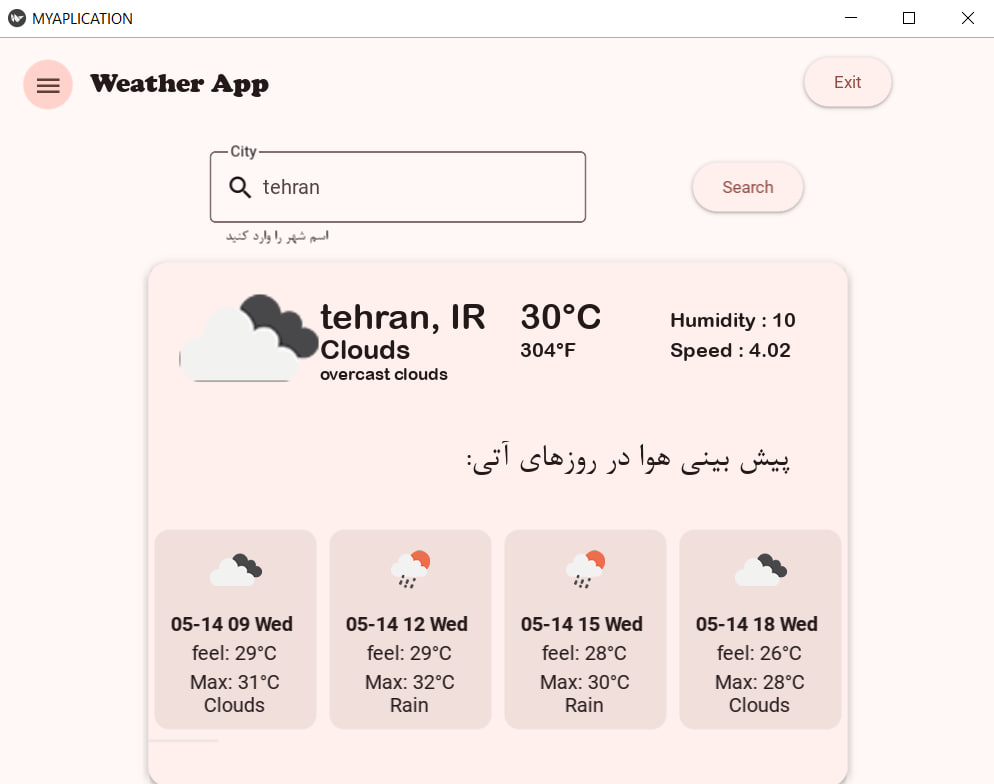
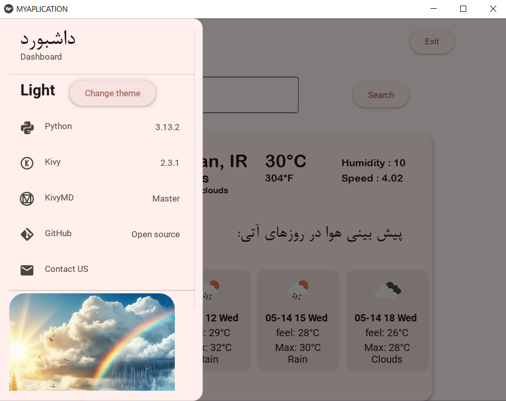

# weather-app

A SIMPLE WEATHER APP WITH KIVY

اپلیکشن گرفتن وضعیت آب و هوا با کیوی


## 📸 Screenshots

### 🏠 Home Screen


### ⚙️ Dashboars Screen


## Requirements:
- **Python**: 3.13.2
- **Kivy**: 2.3.1
- **Kivymd**: Master


## Installation:
At first create Environment:
```bash
python -m venv venv
```
then active Environment:
```bash
venv\Scripts\activate
```

To install the required dependencies, use the following command:
first install kivymd master version
```bash
pip install https://github.com/kivymd/KivyMD/archive/master.zip
```
then:

```bash
pip install -r requirements.txt
```
run main.py

```bash
python main.py
```

GoodLuck
